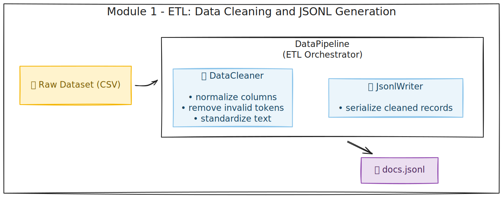
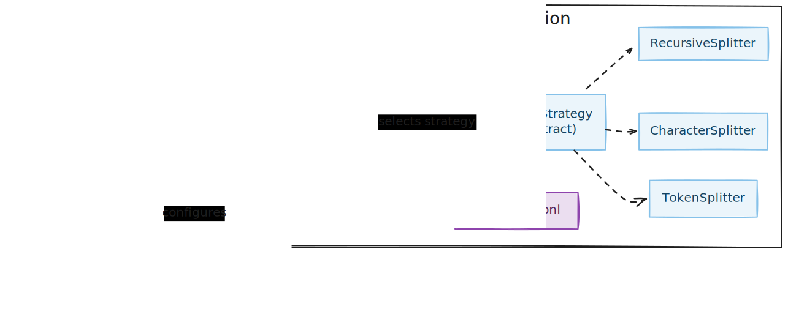
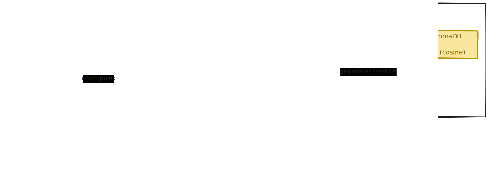
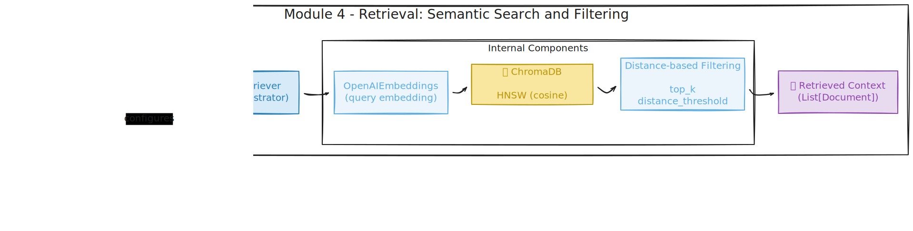
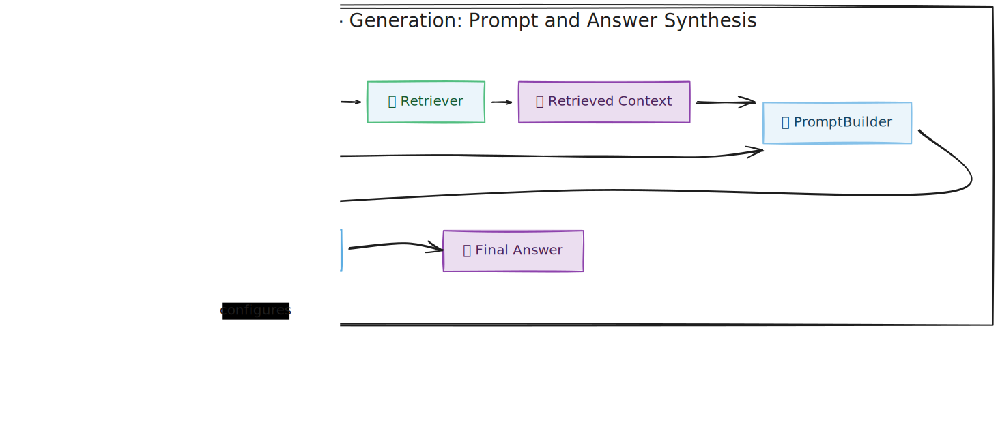

# **RAG Movie Plots**

**RAG Movie Plots** is a modular, research-oriented Retrieval-Augmented Generation (RAG) project built on top of the [Wikipedia Movie Plots dataset](https://www.kaggle.com/datasets/jrobischon/wikipedia-movie-plots). 

Rather than just presenting a working RAG example, the project focuses on **architectural clarity**, empirical design choices, and observability. Each stage of the pipeline is documented, examined, and tested through exploratory analysis and controlled experiments.

It demonstrates an end-to-end RAG pipeline, from ingestion to evaluation, using **LangChain**, **ChromaDB** and **RAGAS**. It retrieves relevant movie descriptions and answers user questions using a language model (LLM) such as OpenAI's `gpt-4o-mini`.

---

## **Project Goals**

- Design a **clean, inspectable, end-to-end RAG pipeline**
- Separate **offline ingestion** from **online retrieval and generation**
- Ground architectural decisions (e.g. chunking) in data-driven analysis
- Enable transparent debugging and evaluation of retrieval behavior
- Support controlled experimentation across chunking, retrieval, prompt, and model choices

---

## **Architectural Separation**


> **Figure 1.** Separation between offline knowledge construction and runtime retrieval and generation.


This project follows a **two-phase Retrieval-Augmented Generation (RAG) architecture** designed to enforce a clean separation between **offline data preparation** and **online retrieval and generation**. The pipeline is decomposed into **five modular components**, distributed across these two phases.

## **Phase 1: Offline Ingestion**

Phase 1 prepares all data required for retrieval and runs entirely offline. It is responsible for transforming raw tabular data into a searchable vector representation.


### **Module 1 - ETL: Data Cleaning and JSONL Generation**


> **Figure 2.** ETL module architecture showing how the DataPipeline orchestrates data cleaning and JSONL serialization, producing the `docs.jsonl` artifact used by downstream stages.

This module is responsible for transforming the raw tabular dataset into a clean, structured, and serialized document representation suitable for downstream chunking and embedding.

**Key responsibilities:**
- Load the raw CSV dataset
- Clean, normalize, and standardize individual columns
- Generate structured documents in `docs.jsonl`

> The ETL layer intentionally focuses on cleaning and standardizing values within individual columns, such as removing uninformative entries and normalizing text formats, without engaging in more complex structural corrections that depend on relationships across multiple fields. These more intricate transformations, such as cross-column consistency checks or semantic deduplication, are intentionally deferred to future iterations, where context-aware strategies can be applied more effectively.

### **Module 2 - Chunking: Text Segmentation**


> **Figure 3.** Chunking module architecture illustrating the strategy-based design used to segment documents into overlapping text chunks, producing the `chunks.jsonl` artifact.

**Key responsibilities:**
- Splits movie plots into smaller, overlapping text chunks
- Applies configurable chunking strategies
- Produces `chunks.jsonl`

> Chunking parameters (chunk size, overlap, separator hierarchy) are grounded in a dedicated exploratory analysis of text structure, rather than heuristic defaults, as documented in the notebook: [2.0-ilfn-chunking_strategy_exploration.ipynb](notebooks/2.0-ilfn-chunking_strategy_exploration.ipynb).

### **Module 3 - Embedding and Vector Persistence**


> **Figure 4.** Vector store module architecture showing how embeddings are generated and persisted in a ChromaDB collection for retrieval.

**Key responsibilities:**
- Generates dense embeddings for all chunks
- Builds and persists a ChromaDB vector store at: `db/chroma/`

> The resulting vector store represents the final output of the offline ingestion phase and serves as the sole knowledge source for online retrieval.

## **Phase 2: Online Retrieval and Genaration**

Phase 2 handles the **online querying flow**, combining semantic retrieval with controlled language generation to answer user questions.

### **Module 4 - Retrieval: Semantic Search and Filtering**


> **Figure 5.** Retrieval module architecture showing how user queries are embedded, matched against the persisted vector store, and filtered to assemble a ranked context for generation.

**Key responsibilities:**
- Loads the persisted vector store
- Encodes user queries using the same embedding model as ingestion
- Executes semantic similarity search over embedded chunks
- Optionally applies distance-based filtering
- Selects and assembles a ranked contextual set for generation

> Retrieval behavior is explicitly observable through structured logs, enabling inspection and debugging before any generation occurs.

### **Module 5 - Generation: Prompt and Answer Synthesis**


> **Figure 6.** Generation module architecture illustrating structured prompt construction and controlled answer synthesis using the selected large language model.

**Key responsibilities:**
- Constructs structured RAG prompts from the retrieved context
- Applies strict prompt-level constraints to prevent hallucinations
- Generates final answers via the selected large language model (LLM)

> Both the generated answer and the exact context used are exposed, ensuring traceability and reproducibility.


Each module is implemented independently and communicates only through **well-defined data artifacts** (e.g., JSONL files, vector stores, retrieved context). 

This design enables controlled experimentation across chunking strategies, retrieval configurations, prompt versions, and model choices, **without entangling concerns across pipeline layers**.

---

## **Project Structure**

```
rag-movie-plots/
├── data/
│   ├── raw/                        # Original unmodified datasets
│   └── processed/                  # Versioned ETL + chunking outputs (JSONL)
│
├── db/
│   └── chroma/                     # Persisted ChromaDB vector store (SQLite + index)
│
├── docs/
│   └── diagrams/                   # Architecture and pipeline diagrams
│
├── logs/                           # Timestamped application logs
│
├── notebooks/                      # Jupyter notebooks for EDA, pipeline tests and RAG evaluation
│   ├── 1.0-ilfn-initial-data-exploration.ipynb
│   ├── 2.0-ilfn-chunking-strategy-exploration.ipynb
│   ├── 3.0-ilfn-rag-ingestion-pipeline.ipynb
│   ├── 4.0-ilfn-rag-online-query.ipynb
│   └── notebook_setup.py          
│
├── src/
│   └── backend/
│       ├── config/                 # Centralized configuration (env-driven)
│       │   └── settings.py
│       │
│       ├── infra/                  # Infrastructure-level abstractions
│       │   └── llm_client.py
│       │
│       ├── pipelines/              # Offline orchestration pipelines
│       │   ├── etl/                # Data cleaning and JSONL generation pipeline
│       │   ├── chunking/           # Chunking pipeline (strategy selection + execution)
│       │   └── vectorstore/        # Embedding generation and vector store persistence
│       │
│       ├── runtime/                # Online / query-time execution
│       │   ├── retrieval/          # Semantic retriever
│       │   ├── chat/               # ChatRAG orchestration
│       │   └── prompts/            # Versioned RAG prompt templates
│       │
│       ├── utils/                  # Logging, helpers, shared utilities
│       │
│       └── main.py                 # Placeholder entry point (future frontend/API integration)
│
├── .env.template                           # Template for generating new env files safely
├── pyproject.toml                          # Project metadata, dependencies, and build configuration
└── uv.lock                                 # Locked dependency versions for reproducible environments


```

## **Notebooks Overview**

**1.0 - Initial Data Exploration**

Exploratory analysis of the raw dataset:
- Distribution of plot lengths
- Dtructural inconsistencies
- Missing and noisy fields

**2.0 - Chunking Strategy Exploration**

A focused, data-driven study of:
- Characters per plot
- Number of lines and paragraphs
- Maximum line length

This notebook directly informs:
- Chunk size
- Overlap
- Choice of recursive character-based chunking

**3.0 - Ingestion Pipeline**

End-to-end offline ingestion:
- ETL: docs.jsonl
- Chunking: chunks.jsonl
- Embedding + ChromaDB persistence

**4.0 - Online RAG Queries**

Query-time experiments:
- Retriever-only inspection
- RAG vs LLM-only comparison
- Context inspection and debugging


## **Environment Setup**

### **Install [uv](https://github.com/astral-sh/uv)**
```bash
pipx install uv
```

### **Sync Environment**
```bash
uv sync
```

### **Configure environment variables**
 ```bash
cp .env.template .env
```

Update the variables according to your local setup.

---


##  **Note: attempt to write a readonly database error**

If you encounter the following error while running the `2.0-ilfn-rag-ingestion-pipeline.ipynb` notebook:

```bash
InternalError: Query error: Database error: (code: 1032) attempt to write a readonly database
```

Simply **restart the Jupyter kernel** and run the cell again. This clears the active `ChromaDB` connection and releases the SQLite lock on `db/chroma`.

---

## **Status**

This repository is under active development.

At the current stage:
- All pipelines are executed directly from Jupyter notebooks
- `main.py` is **not** the primary entry point
- Notebooks act as:
  - Executable documentation
  - Experiment runners
  - Pipeline validation tools

### **Planned Next Steps**
- **RAG Evaluation**  
  Implement systematic evaluation of the RAG pipeline using **RAGAS** (faithfulness, relevance, context precision/recall).
- **Application Layer**  
  Evolve the project into a runnable application by:
  - Defining `main.py` as the primary entry point
  - Integrating a frontend or API layer
  - Supporting interactive user queries beyond notebooks

> The `main.py` file is reserved for a future phase, where it will serve as the integration and execution layer for the full RAG application.


